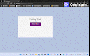

# 04 Web APIs: Code Quiz

## Summary

This task was created as an assignment by Trilogy Education Services at the 
Southern Methodist University Coding Boot Camp. It is to build a timed coding quiz with multiple-choice
questions. It will be a typical coding assessment that contains multiple-choice questions. 
It is made with HTML, CSS and JavaScript that is dynamically changes and runs in the browser.


## User Story

```
AS A coding boot camp student I WANT to take a timed quiz on JavaScript fundamentals that stores high scores
SO THAT I can gauge my progress compared to my peers.
```

## Acceptance Criteria

```
GIVEN I am taking a code quiz
WHEN I click the start button
THEN a timer starts and I am presented with a question
WHEN I answer a question
THEN I am presented with another question
WHEN I answer a question incorrectly
THEN time is subtracted from the clock
WHEN all questions are answered or the timer reaches 0
THEN the game is over
WHEN the game is over
THEN I can save my initials and my score
```

## Mock-Up


This project has been deployed to GitHub pages.

* GitHub Repository:
   https://github.com/DemeSibere/code-quiz-hw

* Deployed GitHub Page:
   https://demesibere.github.io/code-quiz-hw/

* Code Quiz Demo:




---